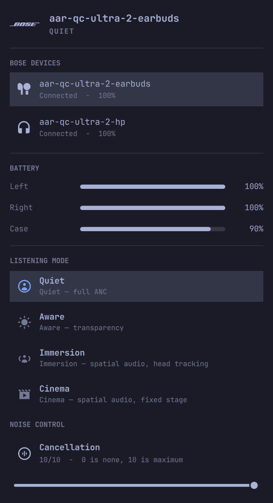
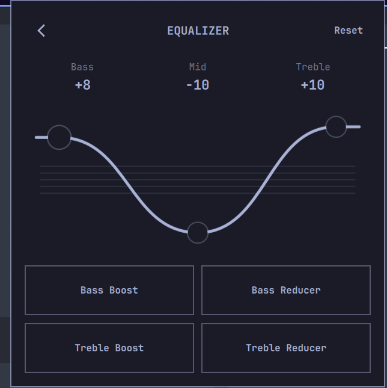
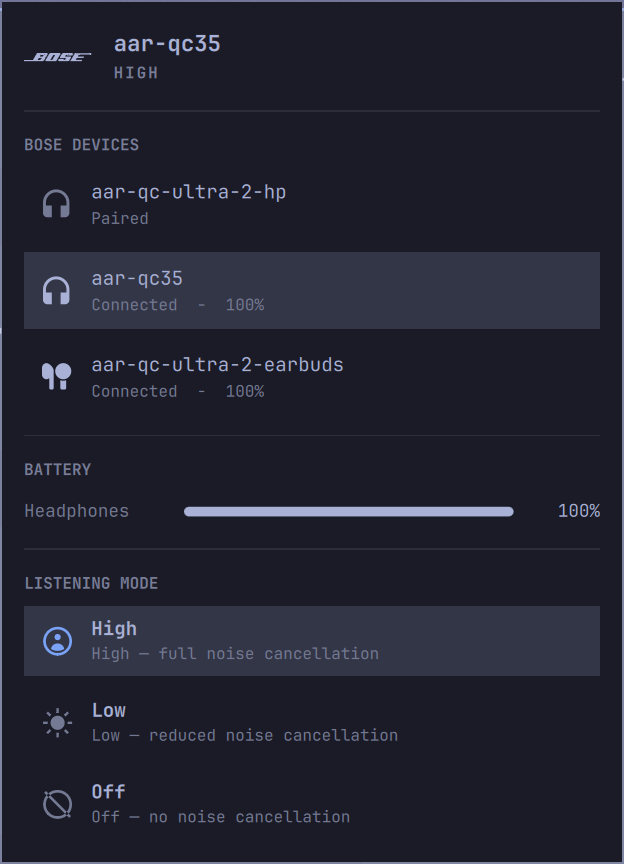

# Bose for Omarchy

A Bose QuietComfort widget for the Omarchy Quattro bar. It shows Bluetooth
connection and battery state, with Bose listening-mode and noise-control actions
and a three-band equalizer through the bundled `bosectl` implementation.

<p align="center">
  
</p>

<p align="center">
  
</p>

<p align="center">
  
</p>

The plugin does not use Bose cloud or account services.

## Install

```bash
omarchy plugin add https://github.com/andresantonioriveros/omarchy-bose.git --enable
```

The command clones the current repository into the user-owned Omarchy plugin
directory and enables the bar widget. The plugin defaults to the right bar
section and can be moved with:

```bash
omarchy bar move io.github.andresariveros.omabose --section right
```

## Requirements

- Omarchy Quattro with the Omarchy shell and Quickshell Bluetooth support.
- BlueZ and a Bose device paired through the system Bluetooth tools.
- System Python 3 with RFCOMM support.

## Bundled runtime

The plugin executes its repository-owned Python bridge directly with
`/usr/bin/python3`. It requires no elevated privileges, system configuration
changes, package installation, commands resolved via `PATH`, or external downloads. Bluetooth state is read by executing only the pinned system binary at `/usr/bin/bluetoothctl` with an argument array and timeouts; the bridge fails closed when that binary is missing or not executable, so a shadow executable earlier in `PATH` can never be picked up. The bridge resolves the selected device's BlueZ product ID against the bundled
catalog and refuses unknown or unsupported products instead of guessing a
protocol configuration.

The bundled `pybmap` source is based on merged `main` commit
[`c816a89`](https://github.com/andresantonioriveros/bosectl/commit/c816a89c7b7ac293b3b27a5462c9b2e74dddb566)
and includes the QuietComfort Ultra Earbuds (2nd Gen) support required for
separate left, right, and case battery readings. Its original MIT license is
included at `bosectl/LICENSE`.

To update the bundled dependency, review the upstream source and the changes
recorded in `bosectl/UPSTREAM.md`, then publish a new plugin version.

## Usage

Open the Bose widget from the bar. Select a paired device to inspect its
battery, listening modes, and noise-cancellation level. Devices that expose
equalizer controls show an `EQ` option at the bottom of the panel. It opens a
dedicated Bass, Mid, and Treble curve with draggable handles, Reset, and the
four Bose presets: Bass Boost, Bass Reducer, Treble Boost, and Treble Reducer.

The panel selects bundled `bosectl` configurations for these device families:

- QuietComfort Ultra Headphones 2
- QuietComfort Ultra Earbuds 2 (product `0x4062`)
- QuietComfort Headphones (`prince`)
- QuietComfort 35 and 35 II
- QuietComfort 45
- QuietComfort Earbuds
- Ultra Open Earbuds (battery and current-mode status; no noise control)

Available controls depend on each device configuration and its verified BMAP
capabilities. QuietComfort 45 support is inherited and has not been validated
on physical hardware. QuietComfort Ultra Earbuds 2 report separate left, right,
and case battery rows through vendor BMAP readings. Equalizer reads and writes
have been physically verified on QuietComfort Ultra Headphones 2 and
QuietComfort Ultra Earbuds 2. QC35 and QuietComfort Headphones (`prince`) do not
advertise the BMAP equalizer feature, so the option remains hidden for them.

Device controls come from the resolved runtime configuration. Unsupported Bose
products remain visible when paired but show a specific unsupported-device
error and receive no BMAP commands.

Protocol observations and the case-charging investigation plan are documented
in [`knowledge/`](knowledge/).

Runtime follow-up measurements are documented in [`TODO.md`](TODO.md). The
current bridge starts only while the panel is open and reads only fields shown
by the panel.

## Reload and removal

The Omarchy shell watches user plugins. Force discovery after a manual change:

```bash
omarchy-shell shell rescanPlugins
```

Disable and remove the plugin with:

```bash
omarchy plugin disable io.github.andresariveros.omabose
omarchy plugin remove io.github.andresariveros.omabose
```

Versions through `0.2.0` created a user-local `bosectl` symlink in
`~/.local/bin`. It is no longer used and may be removed manually after
upgrading.

## License and trademarks

The plugin code is available under the MIT License. Bose and QuietComfort are
trademarks of Bose Corporation. This project is independent and is not
endorsed by Bose.
